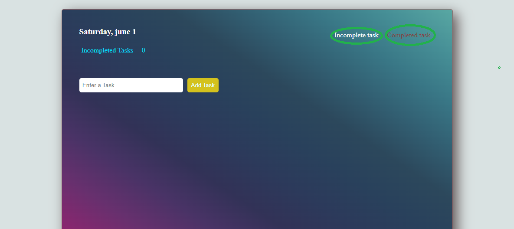

#Introduction

I am very proud of this project, since it was one of my first atempt in to the world of coding! 
It's about a list of items. You can add and remove items from the list as you wish and later you can follow up on your completed tasks.

##Technologies used

In this project i used vanila JavaScript for almost everything. And as far as styling goes i used normal CSS and material CSS for more classic Design features.

## Features and functionality 

This project allows you to create your own list of tasks and check them as completed or not. Completed tasks stays on another page named - "Completed task page" where 
you can look for them later during the day. 
It's important to note that all of the tasks created **stays in cache memory for as long as the application is open.** If you close the window all the information is going away!

## Learning process 

With this project i learned about the importance creating reusable functions. Since this was developed using vanilla javascript, often times elements on the DOM had to be created 
via code! For example: when the user creates a new task, the element will not be displayed on the page unless the "Add task" button is clicked. This means that the content on the page 
is not visable for a while, until the button is clicked. 
Creating a reusable functon can help alot in this cases, so you don't have to write a new function every time the user adds a new task. 
Also it was alot of fun using LOCALSTORAGE and SESSIONSTORAGE for storing data.

## How to run the project 

This project is public, if you want to use it on your computer is totaly free!
Here's the steps: 
* Clone the repository by copying its HTTPS URL or just copy this line
```bash
  https://github.com/SouzaThalez/Todo-list--webApp.git
```
* Run the project using you prefer IDE. I recommend using Visual Studio Code
* Once inside the project make sure node.js is installed on your computer, if you don't have it, download it here: [Download node.js](https://nodejs.org/en/download)
* Use npm command to run your server-side rendering i use this one:
```bash
  npm install -g http-server
```
* Than add the folowing command to run your project:
```bash
  http-server
```
 ## Preview



